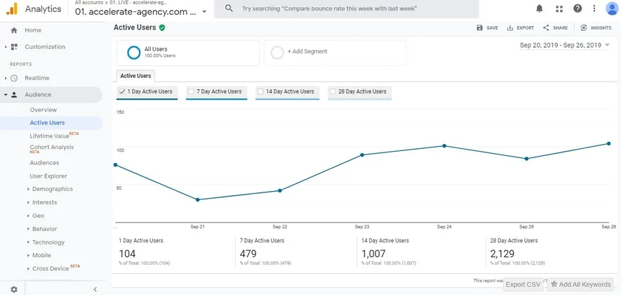

# 我的配置文件

## toml

```toml
[book]
authors = ["Jesse"]
language = "zh-CN"
multilingual = false
src = "src"
title = "Jesse的mdBook入门"

[build]
build-dir = "book"
create-missing = true

[output.html.playpen]
editable = true
copy-js = true

[output.html.print]
enable = false # 关闭打印按钮

[output.html.search]
enable = true
limit-results = 30
teaser-word-count = 30
use-boolean-and = true
boost-title = 2
boost-hierarchy = 1
boost-paragraph = 1
expand = true
heading-split-level = 3
copy-js = true

[output.html]
site-url = "/mdbook_jc/"
mathjax-support = true
google-analytics = "G-SCQ9QM5C81" #网页监控工具
git-repository-url = "https://github.com/cherryamme/mdbook_jc" #右上角githu仓库地址
```

### google-analytics——教程

> 什么是Google Analytics？

Google Analytics可以说是最好用的网站数据分析工具。可用于监测和分析网站的流量、用户行为和目标转化数据，它将生成报告以向您展示，这些报告是您可以用来获得对站点和访问站点的重要洞察力的工具，并根据数据信息有针对性地优化推广渠道并提升网站转化。GA和Google Search Console、Google Tag Manager一样，作为Google官方的网站分析的工具包之一。

**1.数据收集**

首先需要了解Google Analytics的数据收集原理。Google Analytics使用简单的JavaScript代码来收集所有的数据。在为网站设置Google Analytics时，您将获得一串Tacking Code（这将在下文进行解释），您需要将该代码将添加到每个页面，当用户首次访问网站时，会在浏览器中创建一个_ga cookie，然后，该cookie会将hit数据发送到您的Google Analytics，报告用户与您的网站的每次互动。


从Google Analytics收集的数据中，我们可以获得很多有意义的信息，例如：


● 您的页面获得了多少访问者？

● 访客来自哪里？

● 访问者如何浏览您的网站？

● 访问者在您的页面上做了什么？

● 访问者如何与您页面上的元素进行交互？

● 访客在您网页上停留的时间多长？

● 用户在访问的哪个阶段离开您的网站？


**2.跟踪Hit的类型**

在Google Analytics中，用以说明不同的检测层次范围的表述有三个，分别是hit、sessions和user。其中Hit（命中）表示单个的行为，Google Analytics可以跟踪三种不同类型的hit：


● Pageview Hit（网页浏览量）–用户访问网页时所发送的一次hit。它包含访问者正在使用的设备和浏览器之类的信息。您还可以查看他们访问了哪些页面。

● Event Hit（事件命中）- 当访问者在网站上执行了一次事件操作时发送的hit。例如，他们可能填写表格，单击链接或播放视频。

● Transaction/Ecommerce Hit（电子商务命中）–网站访问者购买商品时发送的hit。它可包含访问者在购买之前浏览过哪些页面，购买了哪些产品，总花费是多少等。


**3.数据处理**

Google Analytics不会向您提供平台收集的原始数据。它首先需要处理数据，然后生成报告。数据处理的第一阶段是按User和Session来分离数据。


● User用户数据–有关网站不同访问者的数据。Google Analytics会为您网站的每个新访问者创建一个唯一的随机用户ID。后续有同一用户再次访问您的网站，Google Analytics会识别到该用户ID，然后将其记录为“回访者returning visitor”（仅当他们使用同一设备访问时，此方法才有效）。

● Session会话数据–用户在您的网站上有超过30分钟无中断的活动，那么可定义为一个session。当用户首次访问该网站时，它首先以点击浏览量开始，然后一直持续到他们最终离开该网站为止。在每个会话期间，Google Analytics都会收集大量不同类型的会话数据。


**4.报告生成**

Google Analytics的数据处理过程最终将以报告的形式呈现给您，它们是数据的直观表示，旨在让您轻松读懂并获得有效见解。毕竟，视觉效果在传达复杂思想方面更为有效。


例如，下图是显示该站点在一段时间内获得的用户数量的报告：




**5.什么是维度和指标**

Google Analytics中的每个报告都由维度和指标组成，大多数报告中的表格会逐行显示维度值，逐列显示指标值。对于我们来说，了解各个维度和指标的含义对于读懂报告是非常重要的。


**维度**–指所收集数据的基本属性。例如，“国家/地区”维度表示发起会话的用户来自哪个国家/地区。

**指标**–指量化衡量标准。例如，“会话”指标可以告诉您一段时间内您的网站上进行了多少次会话。


Google Analytics会创建一系列默认报告。稍后我们将深入研究其中的许多内容。您还可以创建结合了不同维度和指标的自定义报告。


并非所有维度和指标都能随意组合使用。每个维度和指标都有各自的数据范围：“user级”，“session级”和“hit级”。在大多数情况下，只有将具有相同范围的维度和指标组合在一起才有意义。比如说，“会话数”是基于会话的指标，因此只能与会话一级的维度（例如“来源”或“城市”）搭配使用。


为什么需要Google Analytics？


您可以将Google Analytics用于多种目的。而下文中，我们将快速回顾三种最常见的应用场景。


**1. 市场营销分析**

从Google Analytics报告中获得的洞察对于改善营销至关重要。其收集的数据可以帮您回答有关营销工作的一系列问题：


● 不同的营销渠道为您的网站带来了多少流量？

● 哪个网站带来了最多的引荐流量？

● 网站访问者主要来自哪些国家/地区？

● 不同渠道访问者的转化率分别是多少？


这些问题的答案将帮助您更好地调整营销方向和节奏，例如告诉您最适合加大投资和需要减少精力的渠道是什么。除此之外，它还可以帮助您更好地定义目标受众，精准投放。


**2. 提升网站性能**

Google Analytics报告也是了解您的网站以及访问者的最佳出处。在这方面，GA可回答的问题更加丰富：


● 网站哪个页面的访问量最多？

● 访问者在哪一步离开了我的网站？

● 网站页面的加载速度有多快？

● 使用移动设备的访客的加载时间是否更长？


这些见解将为您提供改进站点性能的实用方法，设定具体的优化目标。例如，我们发现博客页面获得了很多流量，这意味着可以进一步优化并发布新的内容来获取更多的访问量。


**3. 促进SEO优化**

Google Analytics洞察对于网站的SEO工作优化也十分宝贵。它可帮助回答一系列有关用户如何找到您的网站并与您的网站互动的问题：


● 您的网站获得了多少自然搜索流量？

● 哪个着陆页的访问量最多？

● 访客使用哪些搜索查询来找到您的网站？

● 不同流量来源的访问者在网站中的跳出率情况如何？


您对网站访问者和目标受众了解的信息越多，SEO工作优化方向将越明确。Google Analytics可供访问和评估有价值数据的报告，帮助您从SEO工作中看到更高的投资回报率。

如何设置Google Analytics?

为网站安装配置Google Analytics其实非常简单。您首先需要一个Gmail账号，用其登录https://www.google.com/analytics/，就可开始设置了。